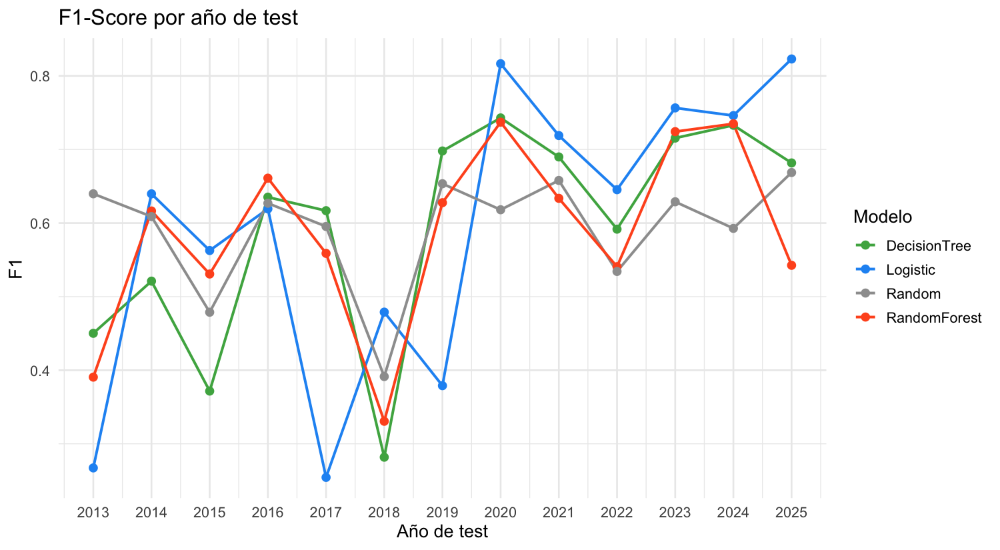

# Euro Stoxx 50 — Direction Classification with Sliding Windows


Final practice for *Análisis de Datos en el Sector Financiero* (UC3M, MSc FinTech). The project asks a single, sharply defined question:

> **Will the Euro Stoxx 50 close higher 50 trading sessions from now than it does today?**

Three supervised classifiers (logistic regression, decision tree, random forest) are trained against a battery of technical features, evaluated on **expanding sliding windows** rather than a single train/test split, and benchmarked against a **random classifier** baseline. The honest result, spoiler-free upfront: **none of them beats the random baseline** on this target. That negative finding — and what it says about the predictability of 50-session forward direction — is the substance of the project.

---

## Tech stack

| Area | Choice |
| :--- | :--- |
| Language | R 4.x |
| Data | Euro Stoxx 50 (`^STOXX50E`) via `quantmod::getSymbols` |
| Models | `glm` (logistic), `rpart` (CART), `randomForest` |
| Indicators | `TTR` (RSI, MACD, ADX, Bollinger, ROC) |
| Evaluation | `pROC::auc` for AUC, hand-rolled accuracy / F1 |
| Reporting | Quarto (`informe.qmd`) → PDF, with R Markdown fallback (`informe.Rmd`) |

---

## Project layout

```
eurostoxx50-classification-sliding-windows/
├── main.R               # Entry point — runs the full pipeline end to end
├── informe.qmd          # Quarto report (renders the PDF)
├── informe.Rmd          # R Markdown alternative
├── informe.pdf          # Pre-rendered final report (committed for review)
├── data/                # Cached download + engineered features
│   ├── eurostoxx50_raw.rds
│   └── eurostoxx50_features.rds
├── results/             # Metric tables produced by main.R
│   ├── metrics_summary.csv
│   ├── metrics_windowed.csv
│   ├── predictions_all.csv
│   └── rf_importance.rds
└── figures/             # Pre-rendered output of the analysis
    ├── accuracy_temporal.png
    ├── auc_temporal.png
    ├── f1_temporal.png
    ├── metrics_barplot.png
    └── rf_importance.png
```

---

## Quick start

```bash
cd eurostoxx50-classification-sliding-windows
Rscript main.R
```

`main.R` is idempotent: it only re-downloads if the cache is missing, and it always rewrites `results/` and `figures/` from scratch. Recompiling the report:

```bash
quarto render informe.qmd
# or, if Quarto is not installed:
Rscript -e 'rmarkdown::render("informe.Rmd")'
```

The PDF render needs a TeX distribution (`tinytex::install_tinytex()` if missing).

---

## Methodology

### Target

`y = 1` if the 50-session forward log return is positive, `0` otherwise. Computed as `fwdReturns(Adj.Close, 50) > 0`.

### Features

Three families of technical indicators on `Adj.Close` (and HLC where the indicator demands it):

- **Trend / momentum** — RSI(14), MACD signal, ADX(14), rate of change ROC(20).
- **Volatility / band-position** — Bollinger band position, rolling 20-session volatility.
- **Past-return context** — log returns at look-backs of 10 and 65 sessions, deviation from 30-session moving average.

### Training discipline — sliding windows

Instead of a single train/test split, the dataset is evaluated with **expanding sliding windows**:

- Initial training set = first `MIN_TRAIN = 3` years of observations.
- For each subsequent year, the **previous years' data are used to fit**; the **current year is the test set**.
- Metrics are computed *per window*, then aggregated.

This is the realistic backtest design: a model only ever sees information available *before* the test period it is scored on. There is no global hyperparameter tuning that leaks future information into the past.

### Baseline — random classifier

A pure-noise classifier draws each prediction uniformly from `{0, 1}`. The procedure is repeated `N_RAND_RUNS = 50` times and averaged so the baseline isn't penalised by a single unlucky draw. Any classifier that fails to **beat this baseline by a meaningful margin** is, for this target, no better than guessing.

---

## Results

### Aggregate metrics

Means across all sliding windows (full table in [`results/metrics_summary.csv`](results/metrics_summary.csv)):

| Model | Accuracy | Precision | Recall | F1 | AUC |
| :--- | ---: | ---: | ---: | ---: | ---: |
| Logistic Regression | 0.5113 | 0.6229 | 0.6977 | 0.5929 | **0.6376** |
| Decision Tree (CART) | 0.5207 | 0.6105 | 0.6093 | **0.5946** | 0.5504 |
| Random Forest | 0.5007 | 0.6021 | 0.6130 | 0.5869 | 0.5943 |
| **Random** (baseline) | 0.5184 | 0.6194 | 0.5869 | 0.5919 | 0.5000 |

Reading:

- **Accuracy.** All three models hover around **51 %** — *literally indistinguishable from random* on this metric. Decision Tree edges the random baseline by 0.2 percentage points; that's noise at this sample size.
- **AUC.** Logistic regression is the only model that meaningfully beats AUC = 0.5: **0.638**. That number says that, *on average*, a randomly chosen positive-class day gets ranked higher than a randomly chosen negative-class day 64 % of the time — better than random, but a long way from "investable signal".
- **F1.** The picture is uniform: every model lands within 0.005 of the random baseline. All four classifiers are essentially picking up the class prior, not the signal.


### Metrics across time

The story is consistent across windows. Accuracy and F1 oscillate around 0.5 with no model holding a stable lead. AUC is more nuanced — Logistic Regression is the most consistent on the discrimination metric, but every model has windows where it underperforms the random baseline:




The standard deviations in the summary table tell the same story: σ(Accuracy) of ~9-13 % across windows, while the mean separation between the best model and the random baseline is < 1 %. The signal-to-noise ratio is unfavourable.

### Random Forest — feature importance

For completeness, the Random Forest's feature importance ranking (averaged across windows):


Even though Random Forest didn't beat the random baseline on this target, the importance ranking highlights which features the model latches onto: short-term RSI, deviation from 30-session moving average, and the past 10-session return are the consistent top three. That ranking informs which features would be worth keeping if the project were extended to a different target horizon (a 5- or 10-session horizon, where short-term reversals tend to carry more information).

---

## Honest reading of the negative result

The clean conclusion is the most useful one: **a 50-session direction target on a major equity index is approximately a coin flip on this feature set.** That fits the standard finance literature — long-horizon equity index direction is dominated by macro regime changes that day-level technical features cannot anticipate.

What the project demonstrates *as engineering* is the discipline that makes this conclusion trustworthy:

- **No look-ahead.** Every sliding window strictly trains on the past and evaluates on the future. Hyperparameters that touch the test data leak into the metrics; this pipeline doesn't have any.
- **Realistic baseline.** The random classifier is run 50 times so the random benchmark is itself a *distribution*, not a single point estimate.
- **Multiple metrics.** Accuracy alone would let an unbalanced-class model look great; tracking precision / recall / F1 / AUC simultaneously prevents that.
- **Reproducibility.** `main.R` writes its outputs to versioned CSV + PDF; the report is the same artefact every time you run it.

In a research context, this would be the point at which the team either pivots to a shorter horizon (where there is plausibly more structure) or moves the target from direction to magnitude / volatility regime — both of which are cleaner signals than 50-session UP/DOWN.

---

## Reference

Final practice for *Análisis de Datos en el Sector Financiero*, MU Tecnologías del Sector Financiero (UC3M, 2025/2026). The full Spanish report — including the discussion of feature engineering, model rationale and limitations — is rendered at [`informe.pdf`](informe.pdf), with both the Quarto and R Markdown sources preserved for reproducibility.
