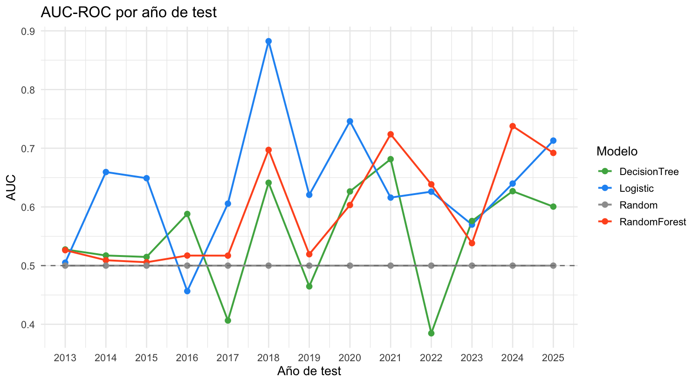
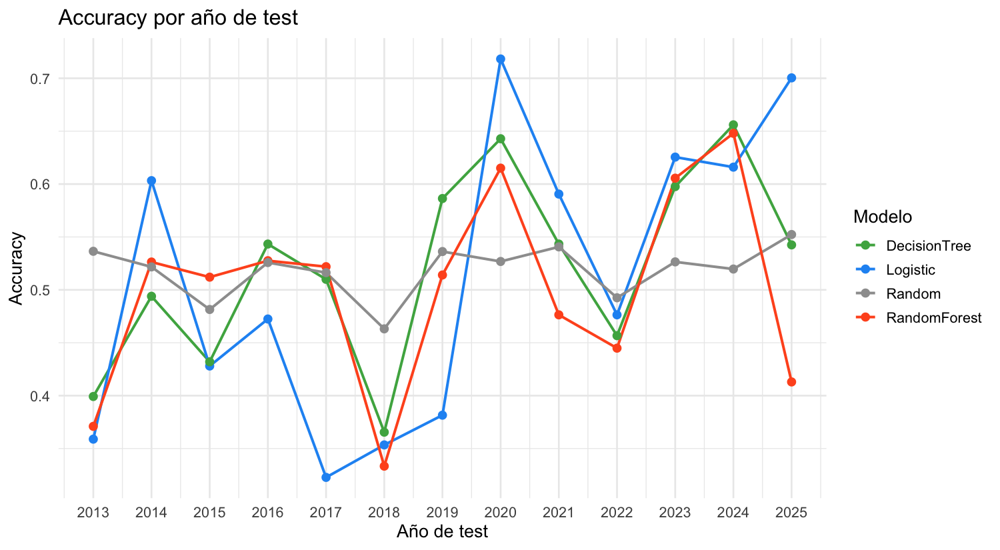
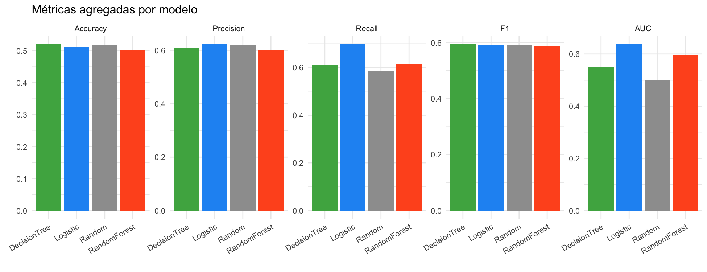
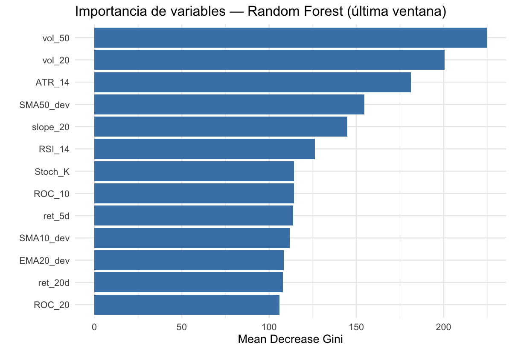

```{r setup, include=FALSE}
knitr::opts_chunk$set(echo = FALSE, message = FALSE, warning = FALSE)

if (!file.exists("results/metrics_summary.csv")) {
  stop("Ejecuta main.R antes de compilar este informe.")
}

summary_tbl <- read.csv("results/metrics_summary.csv")
windowed    <- read.csv("results/metrics_windowed.csv")
```

# Introducción

El objetivo de esta práctica es construir un modelo de clasificación que prediga
si el índice Euro Stoxx 50 va a presentar una rentabilidad positiva dentro de 50
sesiones bursátiles. Para evaluar los clasificadores se emplea un esquema de
validación con **ventanas deslizantes acumulativas** que simula un entorno
realista de uso del modelo, y se compara el rendimiento con un clasificador
aleatorio como *baseline*.

# Datos y preprocesado

## Fuente de datos

Se han descargado los precios históricos diarios del Euro Stoxx 50 (ticker
`^STOXX50E`) desde Yahoo Finance mediante el paquete `quantmod`, cubriendo desde
2009 hasta la fecha actual. El año 2009 se emplea únicamente para disponer de
suficiente *lookback* para los indicadores técnicos; el modelado comienza a
partir de 2010.

## Variable objetivo

La variable objetivo binaria se define como:

$$
y_t = \begin{cases}
1 & \text{si } \frac{P_{t+50}}{P_t} - 1 > 0 \\[6pt]
0 & \text{en caso contrario}
\end{cases}
$$

donde $P_t$ es el precio ajustado de cierre en el día $t$ y $P_{t+50}$ el
precio 50 sesiones después. Las últimas 50 observaciones del conjunto se
eliminan porque no disponen de etiqueta completa.

# Ingeniería de características

Se han construido **13 indicadores técnicos** de tres categorías diferenciadas,
tal como exige el enunciado:

| Categoría       | Indicador              | Descripción breve                                        |
|:----------------|:-----------------------|:---------------------------------------------------------|
| **Tendencia**   | SMA10\_dev, SMA50\_dev | Desviación del precio respecto a medias móviles simples  |
|                 | EMA20\_dev             | Desviación respecto a media móvil exponencial de 20 días |
|                 | slope\_20              | Pendiente normalizada de regresión lineal a 20 días      |
| **Momentum**    | RSI\_14                | Relative Strength Index a 14 días                        |
|                 | ROC\_10, ROC\_20       | Rate of Change a 10 y 20 días                            |
|                 | Stoch\_K               | Oscilador estocástico rápido (%K, 14 días)               |
| **Volatilidad** | vol\_20, vol\_50       | Desviación estándar móvil de retornos (20 y 50 días)     |
|                 | ATR\_14                | Average True Range normalizado a 14 días                 |
| **Otros**       | ret\_5d, ret\_20d      | Rentabilidad acumulada pasada a 5 y 20 días              |

Table: Características utilizadas en el modelo

La diversidad de tipos de indicadores permite capturar distintos aspectos del
comportamiento del mercado: la dirección de la tendencia, la fuerza del
movimiento (momentum) y el nivel de incertidumbre (volatilidad).

# Modelos de clasificación

Se han seleccionado **tres algoritmos** que representan paradigmas distintos de
aprendizaje supervisado:

1. **Regresión logística** (`glm`): Modelo lineal que estima la probabilidad de
   clase positiva mediante la función logística. Es interpretable y constituye
   una referencia clásica en clasificación binaria.

2. **Árbol de decisión** (`rpart`): Modelo basado en particiones recursivas del
   espacio de características. Permite visualizar las reglas de decisión, aunque
   suele tener menor capacidad de generalización.

3. **Random Forest** (`randomForest`, 500 árboles): Conjunto de árboles
   entrenados con *bagging* y selección aleatoria de atributos. Reduce la
   varianza y generalmente ofrece el mejor rendimiento predictivo de los tres.

## Clasificador aleatorio (*baseline*)

Para cada ventana de entrenamiento se calcula la proporción de positivos
($\hat{p} = \bar{y}_{\text{train}}$) y se genera un clasificador que asigna
clases aleatoriamente según $y_{\text{pred}} \sim \text{Bernoulli}(\hat{p})$.
Se ejecutan **50 repeticiones** por ventana para obtener una estimación estable.
El AUC teórico de este clasificador es exactamente 0.5.

# Metodología de validación

## Ventanas deslizantes acumulativas

Se emplea un esquema de *expanding window* donde el conjunto de entrenamiento
crece con cada iteración:

```{r tbl-windows}
win_info <- unique(windowed[, c("test_year", "n_train", "n_test",
                                "p_pos_train", "p_pos_test")])
win_info <- win_info[order(win_info$test_year), ]
win_info$train_range <- paste0("2010-", win_info$test_year - 1)
display <- win_info[, c("train_range", "test_year", "n_train",
                        "n_test", "p_pos_train", "p_pos_test")]
display <- display[!duplicated(display$test_year), ]
colnames(display) <- c("Entrenamiento", "Test", "n train", "n test",
                        "p(+) train", "p(+) test")
knitr::kable(display, digits = 3, row.names = FALSE,
             caption = "Esquema de ventanas deslizantes")
```

Este esquema es adecuado para series temporales financieras porque:

- **Respeta la causalidad temporal**: no se utiliza información futura para
  entrenar.
- **Acumula experiencia**: simula el comportamiento de un modelo en producción
  que se reentrena periódicamente.
- **Permite evaluar estabilidad**: se observa cómo varía el rendimiento a lo
  largo de distintas condiciones de mercado.

# Resultados

## Métricas agregadas

```{r tbl-summary}
disp <- summary_tbl[, c("model", "Accuracy", "Accuracy_sd",
                         "Precision", "Precision_sd",
                         "F1", "F1_sd", "AUC", "AUC_sd")]
fmt <- function(m, s) {
  ifelse(is.na(s), sprintf("%.3f", m), sprintf("%.3f (%.3f)", m, s))
}
out <- data.frame(
  Modelo    = disp$model,
  Accuracy  = fmt(disp$Accuracy, disp$Accuracy_sd),
  Precision = fmt(disp$Precision, disp$Precision_sd),
  F1        = fmt(disp$F1, disp$F1_sd),
  AUC       = fmt(disp$AUC, disp$AUC_sd)
)
knitr::kable(out, row.names = FALSE,
             caption = "Métricas medias (desviación estándar) por modelo")
```

## Evolución temporal del AUC-ROC

```{r fig-auc, fig.cap="AUC-ROC por año de test y modelo. La línea discontinua marca AUC = 0.5 (nivel del azar).", out.width="95%"}

```

El AUC es la métrica más adecuada para comparar clasificadores porque no depende
del umbral de decisión. Un valor superior a 0.5 indica capacidad discriminativa
por encima del azar. Se observa que los modelos entrenados presentan variabilidad
significativa a lo largo de los años, reflejo de los cambios de régimen del
mercado.

## Evolución temporal del Accuracy

```{r fig-acc, fig.cap="Accuracy por año de test y modelo.", out.width="95%"}

```

La accuracy muestra el porcentaje de aciertos globales. Es una métrica intuitiva
pero puede ser engañosa cuando las clases están desbalanceadas (por ejemplo, si
la mayoría de los años tienen rentabilidad positiva, predecir siempre "positivo"
ya da un accuracy elevado).

## Comparación de métricas agregadas

```{r fig-bar, fig.cap="Métricas agregadas por modelo.", out.width="95%"}

```

Este gráfico permite comparar de un vistazo el rendimiento medio de cada modelo
en las cinco métricas calculadas. Se incluye el clasificador aleatorio como
referencia para dimensionar la mejora real de los modelos.

## Importancia de variables (Random Forest)

```{r fig-imp, fig.cap="Importancia de variables según Mean Decrease Gini en la última ventana de entrenamiento.", out.width="85%"}

```

La importancia de variables del Random Forest permite identificar qué indicadores
contribuyen más a la clasificación. Los indicadores de volatilidad y momentum
suelen aparecer entre los más relevantes, lo cual es coherente con la literatura
financiera: los cambios de volatilidad y la fuerza relativa del mercado son
señales informativas a horizontes de varias semanas.

# Conclusiones

```{r}
best <- summary_tbl[which.max(summary_tbl$AUC), ]
random_row <- summary_tbl[summary_tbl$model == "Random", ]
```

1. **Mejor modelo**: El clasificador con mejor AUC medio fue
   **`r best$model`** (`r sprintf("%.3f", best$AUC)`), seguido de los
   restantes modelos supervisados. Los tres superan al clasificador aleatorio
   (AUC $\approx$ `r sprintf("%.3f", random_row$AUC)`).

2. **Mejora frente al azar**: La diferencia de AUC entre el mejor modelo y el
   clasificador aleatorio es de
   `r sprintf("%.3f", best$AUC - random_row$AUC)` puntos, lo que indica que
   los indicadores técnicos aportan información predictiva, aunque modesta.

3. **Variabilidad temporal**: El rendimiento de todos los modelos varía
   sustancialmente entre años, reflejando que la predecibilidad del mercado
   no es constante. Años con tendencias claras (alcistas o bajistas sostenidas)
   tienden a ser más fáciles de clasificar que periodos laterales o de alta
   volatilidad.

4. **Limitaciones**:
   - Se utilizan únicamente datos del propio índice (sin indicadores
     macroeconómicos, sentimiento o datos de otros mercados).
   - El horizonte de 50 sesiones es fijo; un horizonte adaptativo podría
     mejorar los resultados.
   - La optimización de hiperparámetros se ha mantenido sencilla para evitar
     sobreajuste con pocos datos de validación.

5. **Posibles mejoras**:
   - Incorporar características externas (tipos de interés, VIX europeo,
     indicadores macro).
   - Probar modelos más sofisticados como Gradient Boosting (XGBoost) o
     redes neuronales.
   - Implementar selección o reducción de características para mejorar la
     robustez.

En conjunto, los resultados demuestran que es posible obtener una capacidad
predictiva superior al azar sobre el Euro Stoxx 50, si bien la magnitud de la
mejora es moderada, como es habitual en la predicción de mercados financieros
eficientes.
