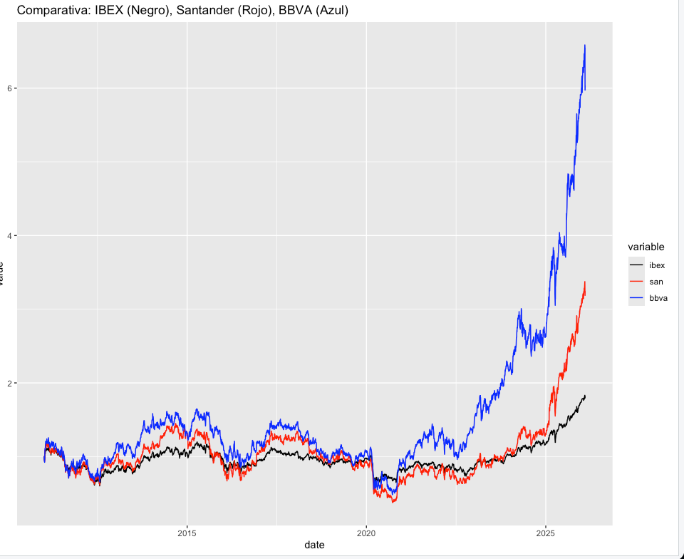
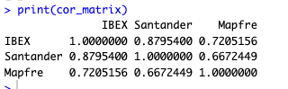
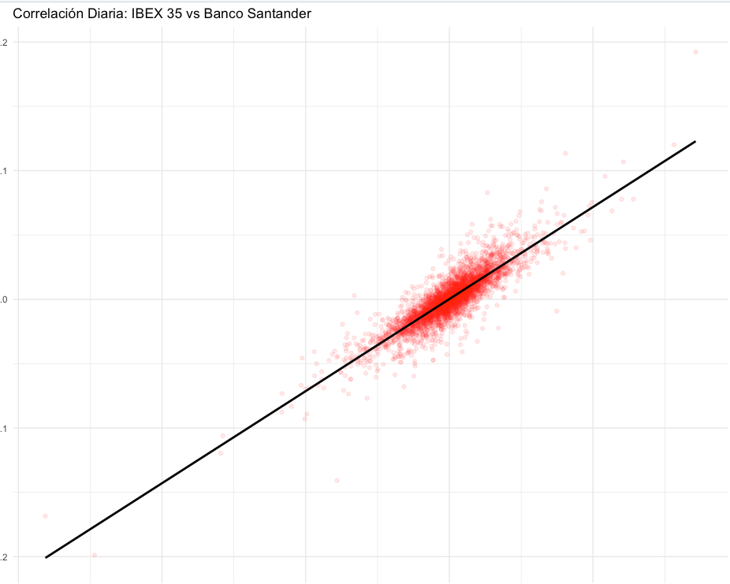
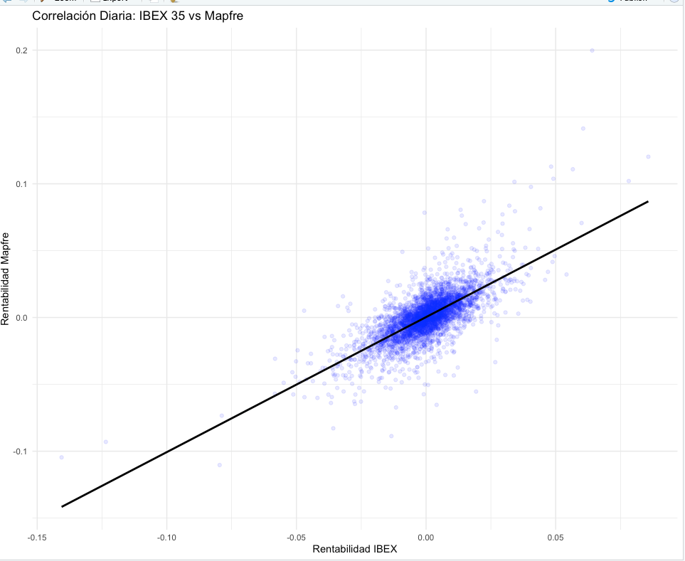

# IBEX 35 — Financial Data Ingestion and Visual Exploration


Automated quantitative analysis pipeline in **R** for the extraction, cleaning, transformation and statistical analysis of Spanish financial assets. The project evaluates **historical performance, volatility and correlation** of three large-caps (Banco Santander, BBVA, Mapfre) against the IBEX 35 benchmark, with explicit attention to **survivorship-safe missing-data handling** and **regression-based market beta** estimation.

The work is built around a modular five-script architecture (`init.R` orchestrator + four functional modules) that mimics how a small quant research team would structure an end-to-end ETL on R.

---

## Tech stack

| Area | Choice |
| :--- | :--- |
| Language | R 4.x |
| Data ingestion | `quantmod` (`getSymbols` against Yahoo Finance) |
| Time series | `xts` |
| Visualisation | `ggplot2` |
| Reshaping | `reshape2` |
| Environment | RStudio |

---

## Architecture

```
R/
├── init.R                  # Orchestrator — loads dependencies and the rest of the modules
├── yahoodatatools.R        # Data layer — local cache + LOCF imputation + column normalisation
├── DescargaBBVA_MAPFRE.R   # Ingestion — getSymbols + xts → CSV adaptor (Yahoo deprecation fix)
├── financialFuns.R         # Quant library — log returns, relative pricing, volatilities
├── ExtraccionDatos.R       # Main entry point — runs the full pipeline + statistical analysis
└── features.R              # Feature engineering helpers (used by later projects)
```

| Module | Responsibility |
| :--- | :--- |
| `init.R` | Dependency loading, source-fan-out to every other module, environment bootstrap. |
| `yahoodatatools.R` | Local CSV cache + LOCF imputation; turns daily Yahoo dumps into a homogeneous trading calendar. |
| `DescargaBBVA_MAPFRE.R` | Modern ingestion via `quantmod::getSymbols`; replaces a legacy `yahoo.readbydate` that broke when Yahoo retired the old endpoint. |
| `financialFuns.R` | Log returns, cumulative performance, relative price normalisation (Base-100), rolling volatility. |
| `ExtraccionDatos.R` | The pipeline you actually run. Loads every asset, applies cleaning, computes returns, fits the OLS regressions and renders the four figures embedded below. |

---

## Methodology — data integrity and imputation

A hybrid two-layer strategy keeps the time series clean without introducing **look-ahead bias**:

### 1. Ingestion layer — Listwise deletion

During the initial ETL phase (`DescargaBBVA_MAPFRE.R`), raw rows containing API errors or null packets are dropped via `na.omit`. Only complete, valid trading records make it past the ingestion boundary.

### 2. Processing layer — Last Observation Carried Forward (LOCF)

To align time series of different assets — when a non-trading day in one venue (a Spanish bank holiday, say) doesn't appear in another — the pipeline applies LOCF inside `cleanTradingData`.

- **Why not linear interpolation or Brownian bridges?** Both preserve volatility structure better than LOCF, *but they introduce look-ahead bias* — they use future observations to back-fill missing past ones, which silently inflates the performance of any backtest that consumes the cleaned series.
- **Why LOCF works.** It assumes the asset's price stays at its last close while the market is closed — the conservative, industry-standard choice for financial backtesting. It cannot reach into the future, by construction.

> Concretely: if a corrupted Tuesday row is dropped during ingestion, the calendar-alignment pass detects the missing trading day and copies Monday's row to fill it.

---

## Project layout

```
ibex35-data-ingestion-and-visual-exploration/
├── R/
│   ├── basedata/                 # Raw daily Yahoo dumps (^IBEX, BBVA.MC, SAN.MC, MAP.MC)
│   ├── data/                     # Calendar-aligned + LOCF-imputed working copies (.xcsv)
│   ├── init.R
│   ├── yahoodatatools.R
│   ├── DescargaBBVA_MAPFRE.R
│   ├── financialFuns.R
│   ├── features.R
│   └── ExtraccionDatos.R
├── figures/                      # Pre-rendered output of the analysis
└── README.md
```

---

## Analysis results

### Relative performance (2011 → today)

Adjusted close prices are normalised to Base-100 to compare the cumulative evolution of BBVA, Santander and Mapfre against the IBEX 35 benchmark.



The figure highlights a material divergence in the banking sector — particularly **BBVA**, which outperforms the index meaningfully across the recent window.

### Daily returns and correlation matrix

Pairwise correlation of daily log returns:



The two banks (BBVA / Santander) show very high mutual correlation, while Mapfre — an insurer — sits noticeably further away on the correlation axis.

### Beta — Santander vs IBEX

Linear regression of Santander daily returns against IBEX daily returns:



- **Correlation:** 0.87.
- **Slope (β):** > 1.

Reading: Santander acts as a **high-beta** stock, amplifying systematic market volatility. A 1 % move in the IBEX maps to a more-than-1 % expected move in Santander, in the same direction.

### Beta — Mapfre vs IBEX



Mapfre shows visibly **higher dispersion** around the regression line. The lower R² captures the **idiosyncratic component** of an insurer's risk profile — its returns are less explained by the systematic market move alone, more by company-specific factors (claims development, sector regulation, reinsurance cycles).

---

## Engineering note — solving the Yahoo Finance deprecation

A real challenge during the project was the obsolescence of the original data-extraction functions (`yahoo.readbydate`), which relied on a Yahoo Finance endpoint that was retired during development. The fix is in `DescargaBBVA_MAPFRE.R`:

- Wrap `quantmod::getSymbols` (which handles the new session-cookie + crumb authentication flow) and translate its `xts` output back into the standard CSV layout the rest of the pipeline already consumes.
- This keeps every downstream module untouched — only the ingestion layer changed, exactly as a layered design would predict.

---

## Quick start

```r
# From R / RStudio:
setwd("/path/to/ibex35-data-ingestion-and-visual-exploration/R")
source("DescargaBBVA_MAPFRE.R")   # refresh the local cache
source("ExtraccionDatos.R")       # run the analysis + render the figures
```

---

## Reference

Implementation of one of the early practices of *Análisis de Datos en el Sector Financiero*, MU Tecnologías del Sector Financiero (UC3M, 2025/2026), focused on the data-acquisition fundamentals every quant research workflow rests on.
